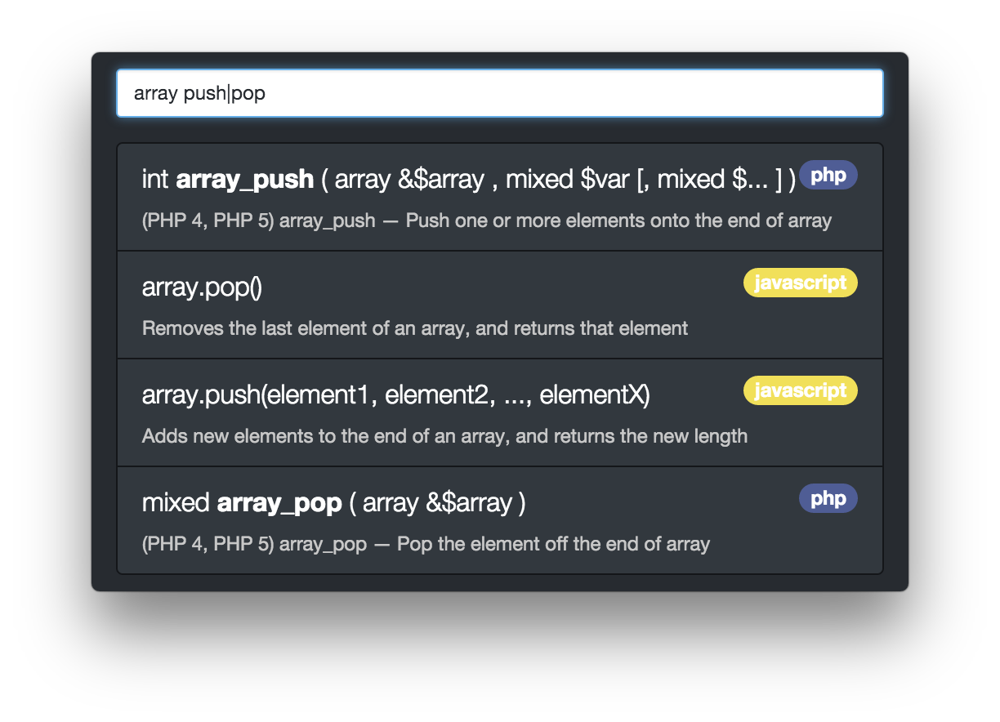

# Piñata

> Documentation providing menubar mechanism

## Features
- Uses the [searchcode.com](https://searchcode.com) API
- Lives in your menu bar
- Customizable shortcut
- Links to documentation source

## Getting started
As soon a you launch the app, it'll live in your menu bar.  
You can open the interface by clicking the icon.  

_Piñata comes without any global shortcut defined. You'll need to set one if you wish to open the interface without clicking the icon._  

### Query
Juste type what you're looking for in the textfield and hit enter.  
__Example:__ `php microtime`  
Results will be displayed under the textfield.  
By clicking a result you'll be sent to the source website.

Adding the language will yield better results.  
You can also use operators such as `!` to negate a word.  
__Example:__ `!php echo`  
Or `|` to act as a 'OR'.  
__Example:__ `php|python echo`

### Commands
- `:quit` or `:q`: quit the app
- `:hotkey`: display status and help about the global shortcut
- `:position`: display status and help about the position
- `:help` or `:?`: display some help
- `:about`: display informations about the app

## Building your very own Piñata
First you'll need npm.  
Then, you'll need to clone or download this repo and run `npm install`
in it.  
Then you can use the following commands:
- `npm start`: starts the app without building it
- `npm run build-osx`: builds the app for OS X (in x64)
- `npm run build-win`: builds the app for Windows (in x64)
- `npm run build-linux`: builds the app for linux (in x64)
- `npm run build-all`: build for all OS (in x64)
- `npm run package`: will package the builded apps in zip/tar.gz

If you only want to build for your OS check out [electron-packager](https://github.com/maxogden/electron-packager) cli.
